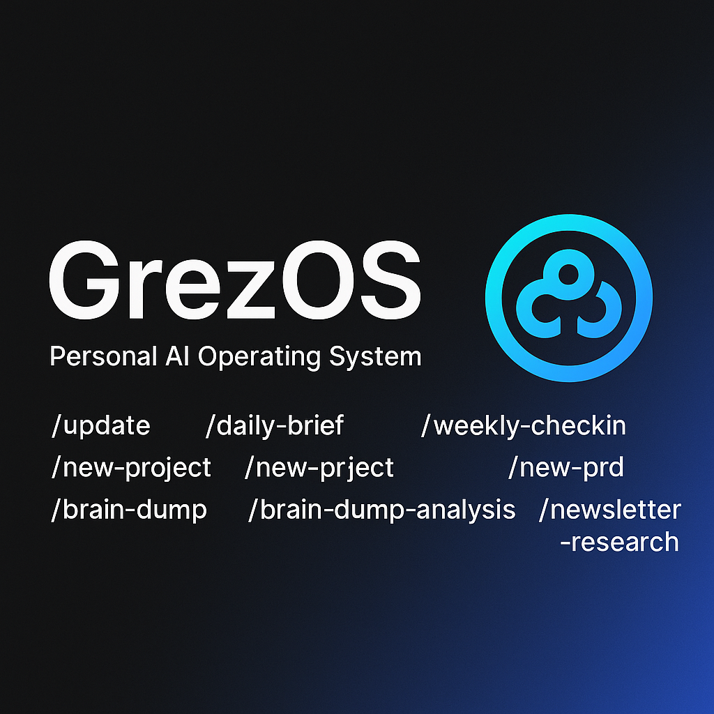

# GrezOS — Personal AI Operating System

GrezOS orchestrates your goals, routines, and creative work through a set of slash-command agents. It keeps private data outside the repository so you can safely share the core system while plugging in your own notes, journals, and metrics.



---

## ✨ Highlights

- Daily intelligence: `/update`, `/daily-brief`, `/nightly-recap`, `/weekly-checkin`.
- Goal & product orchestration: `/new-project`, `/new-prd`, modular launchboards.
- Creativity & communication: `/brain-dump`, `/brain-dump-analysis`, `/newsletter-research`.
- Portable storage: personal artifacts stay under `${GREZOS_STORAGE_PATH}` (default `~/Documents/grez-os`).
- SaaS-ready templates: Seed project `docs/seeds/projects/sizably/` with AGENTS, UxStyle, README, and PRDs.

---

## 🚀 Quick Start

### 1. Clone & Install
```bash
git clone https://github.com/yourname/grez-os.git
cd grez-os
npm install # or bun install per global standards
```

### 2. Configure Storage
Personal data lives outside the repo. Choose a root (defaults to `~/Documents/grez-os`) and run:
```bash
export GREZOS_STORAGE_PATH=~/Documents/grez-os
mkdir -p "$GREZOS_STORAGE_PATH"/{action-plan,daily-brief,data,goals,journal,metrics,newsletter,notes,projects,todos,updates}
```

Each feature directory in this repo includes a `storage/` symlink (for example `notes/storage`) that points to the matching folder under `${GREZOS_STORAGE_PATH}` so you can browse personal data locally without committing it.

### 3. Optional Config File
```bash
cp config/storage.example.json config/storage.json
```
Then in your shell profile:
```bash
export GREZOS_STORAGE_PATH="$(jq -r '.storagePath' /path/to/grez-os/config/storage.json)"
```

---

## 🧠 Architecture

| Area | Description |
|------|-------------|
| **Agents** | Slash commands defined under `.codex/subagents/`, invoked via Codex CLI. |
| **Projects** | Launchboards in `${GREZOS_STORAGE_PATH}/projects/` (surfaced locally at `projects/storage`) with localized `AGENTS.md`, `UxStyle.md`, README, PRDs. |
| **External Storage** | `${GREZOS_STORAGE_PATH}` holds notes, goals, briefs, metrics, updates, etc. |
| **Symlinks** | Each top-level feature folder contains its own `storage/` link for convenience (ignored by git). |
| **PRDs** | Product Requirement Documents capture features; `/new-prd` guides creation. |

---

## 🧾 Slash Commands

| Command | Purpose | Output |
|---------|---------|--------|
| `/update` | Quick life/task status log | `${GREZOS_STORAGE_PATH}/updates/YYYY/YYYY-MM-DD.md` |
| `/daily-brief` | Morning priorities + news | Console + `${GREZOS_STORAGE_PATH}/daily-brief/` |
| `/daily-tasks` | Today’s priorities & carry-overs | `${GREZOS_STORAGE_PATH}/notes/daily/` |
| `/daily-checkin` | Evening reflection & analytics | `${GREZOS_STORAGE_PATH}/journal/daily/` |
| `/nightly-recap` | Goal alignment recap | Console |
| `/weekly-checkin` | Metrics report & insights | `${GREZOS_STORAGE_PATH}/metrics/weekly-report-YYYY-MM-DD.md` |
| `/brain-dump` | Capture free-form thoughts | `${GREZOS_STORAGE_PATH}/notes/brain-dump/` |
| `/brain-dump-analysis` | Extract insights & actions | `${GREZOS_STORAGE_PATH}/notes/brain-dump/analysis/` |
| `/newsletter-research` | Research & draft newsletter | `${GREZOS_STORAGE_PATH}/newsletter/` |
| `/new-project` | Spin up project launchboard | `${GREZOS_STORAGE_PATH}/projects/{slug}/` |
| `/new-prd` | Author a Product Requirement Document | `${GREZOS_STORAGE_PATH}/prds/{feature}.md` |

Each agent resolves `GREZOS_STORAGE_PATH` (fallback `~/Documents/grez-os`).

---

## 🗂 Example Project: Sizably

`docs/seeds/projects/sizably/` ships a reference launchboard you can copy into `${GREZOS_STORAGE_PATH}/projects/`:

- `AGENTS.md` — project charter aligned with global standards.
- `UxStyle.md` — design system (colors #0cd6f5 + black, typography, components).
- `README.md` — project-specific runbook.
- `prds/` — multiple PRDs with frontmatter, statuses, and index.

Use `/new-project` to replicate the workflow directly into your `${GREZOS_STORAGE_PATH}/projects` directory.

---

## 🧩 Storage Layout

```
${GREZOS_STORAGE_PATH}/
├── action-plan/
├── daily-brief/
├── data/
├── goals/
├── journal/
├── metrics/
├── newsletter/
├── notes/
├── projects/
├── todos/
└── updates/
```

Inside the repo:
- Every top-level data folder (e.g., `daily-brief/`, `notes/`, `journal/`) contains a `storage/` symlink pointing at the matching location in `${GREZOS_STORAGE_PATH}`.
- `docs/storage.md` explains setup and portability.

---

## 🛠 Engineering Standards

Global rules (see `~/.codex/AGENTS.md`):

- Next.js (App Router, latest), Tailwind CSS (strict), TypeScript strict.
- Auth.js, Resend, Stripe (Connect when needed), Convex, Google Sign-In.
- No `@ts-nocheck`; honor lint and type checks.
- Responsive, accessible UIs with professional navigation (logo + portal-based mobile menu).
- PRDs with defined sections, kept current with statuses and logs.
- Conventional commits, feature branches, CHANGELOG updates.

---

## 🤝 Contributing & Personalizing

1. Fork or clone the repo.
2. Set `GREZOS_STORAGE_PATH` and create the external directories.
3. After editing prompts, run `bun run scripts/sync-prompts.ts` to refresh Codex CLI.
4. Use slash commands via the Codex CLI to capture data.
5. Launch new projects with `/new-project` (writes to `${GREZOS_STORAGE_PATH}/projects`) and plan features through `/new-prd`.
6. Keep personal data out of git; share sanitized docs if collaborating.

Because storage is external, you can safely share the repository while each contributor keeps their own data root.

---

## 📚 Useful References

- `AGENTS.md` — GrezOS behavior and workflows.
- `docs/storage.md` — personal storage configuration.
- `docs/seeds/projects/sizably/` — SaaS launchboard seed.
- `config/storage.example.json` — template for local storage config.
- `prompts/commands/` — source Markdown for all slash commands (sync with `bun run scripts/sync-prompts.ts`).

---

## 🧭 Roadmap (High-Level)

- Extend multi-project orchestration from `${GREZOS_STORAGE_PATH}/projects/`.
- Integrate additional affiliate providers and richer analytics dashboards.
- Automate beta tester recruitment loops for new SaaS launches.
- Deliver cross-platform client experiences (web/mobile shells) that consume the same workflows.

---

## 📝 License

GrezOS is distributed under the MIT License. See `LICENSE` for the full text.
